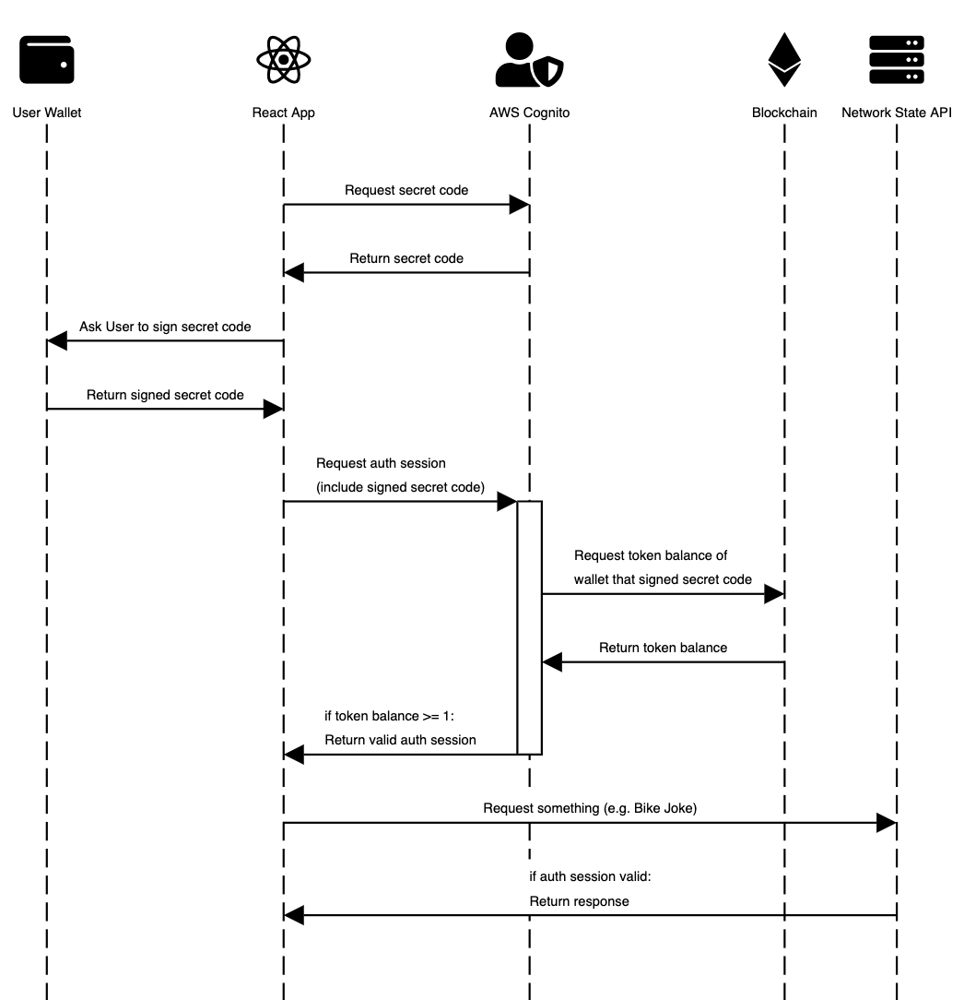

# network-state-backend-aws

Deploy an API that can only be accessed by users holding your token.



This repository contains an AWS CDK Stack that deploys the *AWS Cognito* and *Network State API* resources of the sequence diagram. Have a look at [suud/network-state-example-app-react](https://github.com/suud/network-state-example-app-react) for an implementation of the other parts.

Learn more about the motivation behind this repository by reading [this article](https://blog.suud.org/aws-cognito-nft-auth).

## Prerequisites

- [AWS CDK](https://docs.aws.amazon.com/cdk/v2/guide/getting_started.html#getting_started_prerequisites)

If you are using AWS CDK for the first time, check out the [Introduction to the CDK workshop](https://cdkworkshop.com/).

## Usage

```
# clone repository
git clone git@github.com:suud/network-state-backend-aws.git
cd network-state-backend-aws

# install dependencies
npm install
cd lambda-layers/web3/nodejs
npm install
cd ../../..

# compile typescript to js
npm run build

# deploy stack
cdk deploy \
    --parameters rpcUrl=... \
    --parameters contractAddress=... \
    --parameters tokenId=...
```

## Useful commands

 * `npm run build`   compile typescript to js
 * `npm run watch`   watch for changes and compile
 * `npm run test`    perform the jest unit tests
 * `cdk deploy`      deploy this stack to your default AWS account/region
 * `cdk diff`        compare deployed stack with current state
 * `cdk synth`       emits the synthesized CloudFormation template
